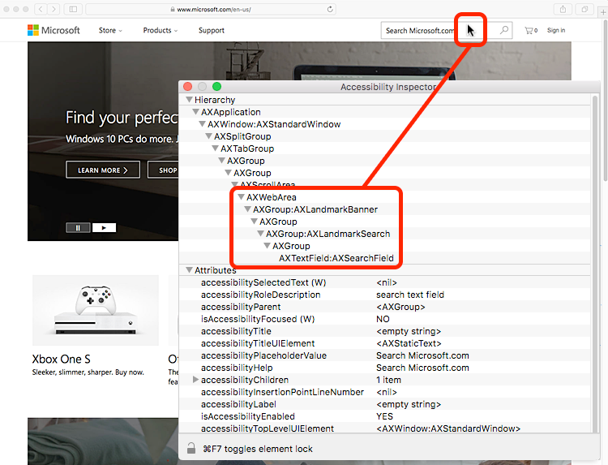

# MacOS

## MacOS accessibility API

MacOS has had an accessibility API since version 10.2. Apple rewrote the accessibility API for version 10.10, which simplified the API with methods-based logic, making it more similar to the iOS accessibility API. The new accessibility API is backward-compatible with the old accessibility API.

For more details, refer to the [Mac OS X accessibility API reference](https://developer.apple.com/library/content/documentation/Accessibility/Conceptual/AccessibilityMacOSX/).

## Inspecting the accessibility API

Apple makes a suite of developer tools known as [Xcode](https://developer.apple.com/xcode/). These tools are not installed by default. You can download Xcode opens in a new window through the Apple store. Once installed, open the application, then in the main menu choose XCode > Open Developer Tool > Accessibility Inspector. To use the inspector, hover the mouse over objects and view the Accessibility Inspector panel to see the accessibility tree.

In the screenshot below, the mouse is hovering over the search field on the Microsoft.com site. The Accessibility Inspector panel shows the following hierarchy (note that the "AX" prefix has been removed in the list below, for clarity):

- Web Area
- Group: Landmark Banner
- Group
- Group: Landmark Search
- Group
- Text Field: Search Field

