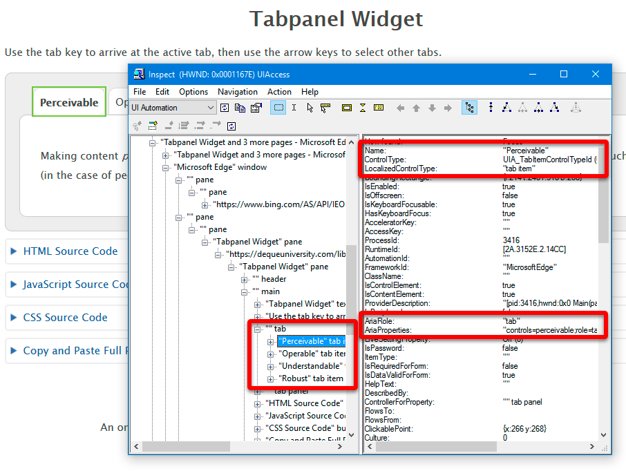
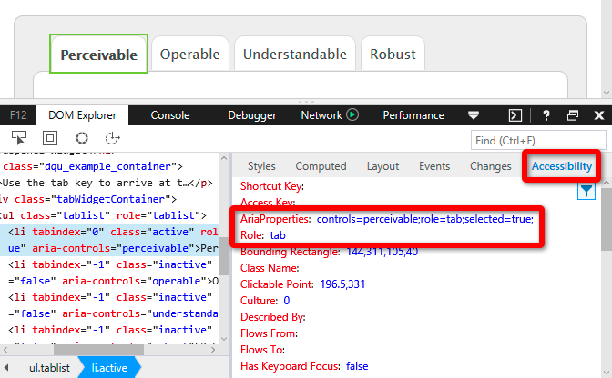

# Windows

## Windows accessibility API

Windows has gone through several iterations of accessibility APIs. The current Windows accessibility API is known as UI Automation, first introduced with Windows Vista. The Edge browser and Narrator screen reader make use of UI Automation.

The older Windows accessibility API, MSAA (Microsoft Active Accessibility) is still used by some legacy software, including Internet Explorer.

## Inspecting the Accessibility API

### Inspect.exe

Use the Inspect.exe tool in the [Windows 10 SDK](https://developer.microsoft.com/en-US/windows/downloads/windows-10-sdk) to expose the accessibility information about elements in Edge or in other Windows software. Be sure Inspect.exe is set to UI Automation mode. Note: After installing Windows 10 SDK, the Inspect.exe application can be found in Program Files > Windows Kits > 10 > bin > [your platform] (or a similar path, if you installed the SDK in a different location).

For more information, refer to the [Windows UI Automation API documentation](https://docs.microsoft.com/en-us/windows/desktop/WinAuto/windows-automation-api-portal)

## The Edge F12 Accessibility Tree

To inspect the accessibility tree in Edge, you can use the Accessibility panel in the F12 developer tools, available from the DOM Inspector tab.

