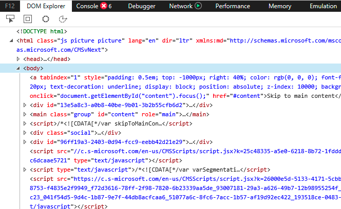

# Linear Content

## The reading order is the DOM order

If screen reader users let their screen reader read through the entire page, it will start at the first element in the DOM (Document Object Model), and proceed until the last element in the DOM.

You can think of the linear progression through the content of a webpage from beginning to end somewhat like automated telephone menu systems which do not reveal all of the options at once. Users must progress through such systems in a step-wise manner.

## Screen readers require a logical linear reading order in the DOM

When you use CSS to position the elements in the web page, you can use attributes such as float, margin, padding, relative positioning, and absolute positioning to drastically alter the visual layout. Sometimes developers pay attention only to the visual layout, and neglect the underlying reading order in the source code, or DOM.

Screen readers ignore the visual placement of the elements on the page, and look only at the order in the DOM. Check to make sure the DOM reading order is logical, by either looking at the DOM directly, by disabling the styles in the browser, or by reading through the web page with a screen reader.
