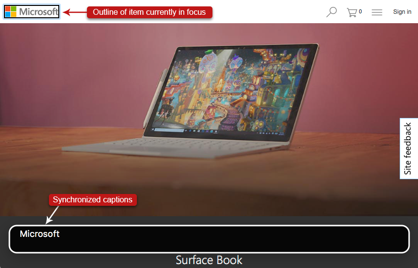

# No Visual Interface

## Screen readers interact invisibly with other software

Screen readers are designed primarily for blind users, so there isn't much of a reason to have a graphical user interface. You turn a screen reader on, and it starts reading the content and/or interface of whichever application is currently in focus in the operating system.

There is no visible menu of screen reader actions to perform, and no visible buttons to click on. You interact directly with the other software—e.g., the web browser—rather than with an interface associated with the screen reader.

Screen readers do have configuration options and settings that you can change, and there is a visual interface to make those adjustments, but there is no visual interface for interacting with a web browser, other than the web browser itself.

The lack of a visual interface can be disorienting for sighted users at first, but with a little practice, you can get used to it.

## You must use keyboard shortcuts

To use a screen reader, you must use some basic keyboard shortcuts. Each screen reader has a different set of keyboard shortcuts, and the list of all available keystrokes is long; far too many to memorize. The good news is that you can get by with just a few keyboard shortcuts for most things. For example, using Narrator, you should know the following, at a minimum:

### Basic Keyboard Shortcuts for Narrator

Turn on/off: Windows key + Enter
Stop talking: Control
Next item: Caps lock + Right arrow
Previous item: Caps lock + Left arrow
Next focusable item: Tab
Previous focusable item: Shift + Tab
Toggle scan mode on/off: Caps lock + Space bar
Next heading: H (in scan mode)
Previous heading: Shift + H (in scan mode)
Next landmark/region: D (in scan mode)
Previous landmark/region: Shift + D (in scan mode)
Navigate table cells: Control + Alt + Arrow keys
Activate a link: Enter
Activate a button: Enter or Space bar
Open and navigate a select list: Alt + Down arrow, then Down/Up arrow

With these basic keystrokes, you can do most of the important things you need to do while testing the accessibility of web content.

## Some screen readers have visual aids

Despite the lack of visual menus, some screen readers—such as Narrator, VoiceOver, and TalkBack—display a visual outline around the item currently in focus. The outline helps sighted users, in particular those with low vision.

VoiceOver on macOS also shows captions of what the screen reader is saying. The captions allow you to test with a screen reader even with the volume on your computer turned down, which can be particularly convenient in public locations.

