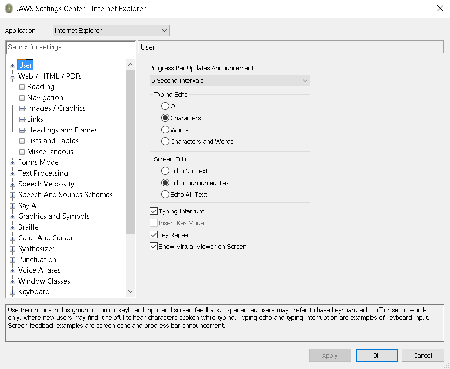
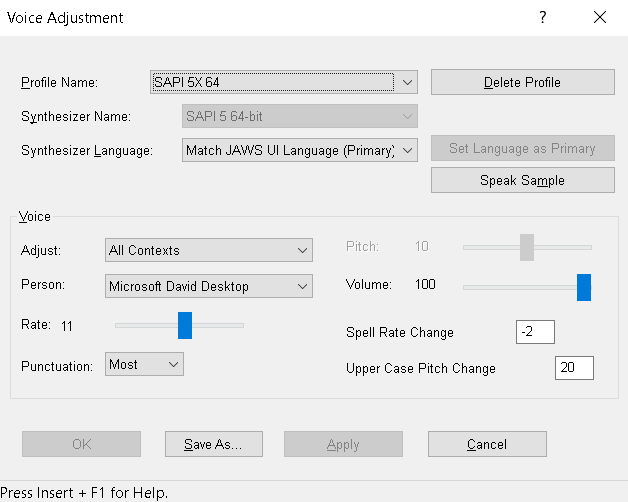

# JAWS Configuration Options

## JAWS installation

To install JAWS on your Windows computer, Freedom Scientific recommends that you download the JAWS release to your computer first instead of running the executable from the Windows Download dialog box. The JAWS download page can be found at: http://www.freedomscientific.com/products/software/jaws/ opens in a new window

You will need to be logged on to an account with administrator privileges on the computer where you are installing JAWS. JAWS requires that you restart your computer during the installation process. The following briefly describes how to download and install a JAWS release.

- Select the appropriate domestic or international JAWS download link that appears on the download page.
- When the dialog box opens, choose Save and select a location where you can easily find the downloaded executable file.
- Run the executable and follow the talking installer. You will be asked whether you want to have JAWS start when your computer boots up. Unless this is a computer dedicated to running JAWS, you probably don't want JAWS to start every time the computer is rebooted.

The Setup Wizard will provide speech and braille output while it guides you through the installation. Follow the prompts and install JAWS like you would install any other Windows software.

## How to start and turn off JAWS

There are three ways you can start JAWS using the keyboard only:

- First, press the Windows key to bring up the Windows Run Dialog. Type in JAWS16 or JAWS17 to start JAWS 16 or JAWS 17 respectively. The latest version of JAWS uses the four-digit year, so type JAWS2019 to run it.
- Or, go to the Windows desktop and press J to go to JAWS (assuming JAWS is the first item starting with a J), and then press Enter to start JAWS.
- The third would be to create a keyboard shortcut for the JAWS program on the desktop and invoke the shortcut (for example: Alt + Control + J).
- To turn off JAWS press Insert+F4 when the JAWS window is open.

## Adjusting JAWS options

JAWS options can be configured using either the Settings Center or Quick Settings. Both features contain various options that can be applied to the program currently in use, the difference being whether the changes are applied temporarily or permanently.

With Quick Settings you can make changes specific to the application you are currently in. The items at the top of the Quick Settings dialog box will be relevant to the current application and the items near the bottom of the list will be more generic.

Quick Settings allows you to determine how long changes will stay in effect. By default, changes are saved permanently. However, in Quick Settings you can specify that settings stay in effect temporarily until:

- A new window gains focus, or
- The JAWS session has ended

To open Quick Settings, press Insert+V.

With Settings Center you can make permanent changes that will apply globally to all applications or just the selected application.
To open Settings Center, press Insert+F2 and select Settings Center. The Web settings are presented in a tree menu format.

Navigate to the "Web / HTML / PDFs" tree menu items and expand it. You'll see a series of options grouped under the following sub-nodes:

- Reading
- Navigation
- Images / Graphics
- Links
- Headings and Frames
- Lists and Tables
- Miscellaneous

Expanding each of the sub-nodes will reveal a new list of potential options for each category. You can make any necessary modifications to your settings here.

From a testing perspective, we do not recommend making changes to these settings. In the majority of cases, the settings found here are preferences most appropriate to daily users of JAWS and not likely to provide any benefit during testing.

You can customize voices used for speech by assigning different voices for different contexts:

- PC Cursor or JAWS Cursor
- Cursor messages, for instance the keyboard voice or speech output produced by typing
- Dialogs and menus
- Tutor and messages

To open voice settings, do the following:

Press Insert+J to make the JAWS window active. Press Alt+O to choose the Options menu. Press V and then press Enter to open the Voice adjustment dialog.

<b>Note:</b> Pressing Insert and J while in an application may result in results other than this.

From here, choose an existing voice profile or a factory voice profile template and change various settings such as language, voice, speech rate, announced punctuation, and more to configure JAWS speech as desired.

For practical purposes, the only things most people change in the Global settings here are the voice rate and perhaps the punctuation.

After making changes, you can save the new settings to an existing profile by selecting "Apply" or to a new voice profile by selecting "Save As". Exit the Voice Adjustment dialog box by selecting "OK" to save changes or "Cancel".
