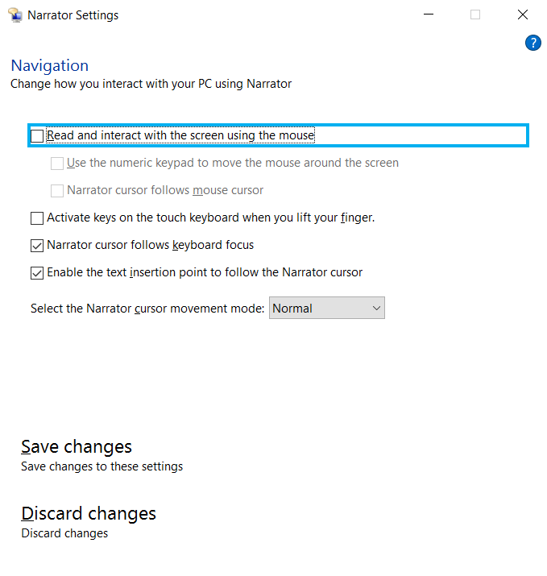
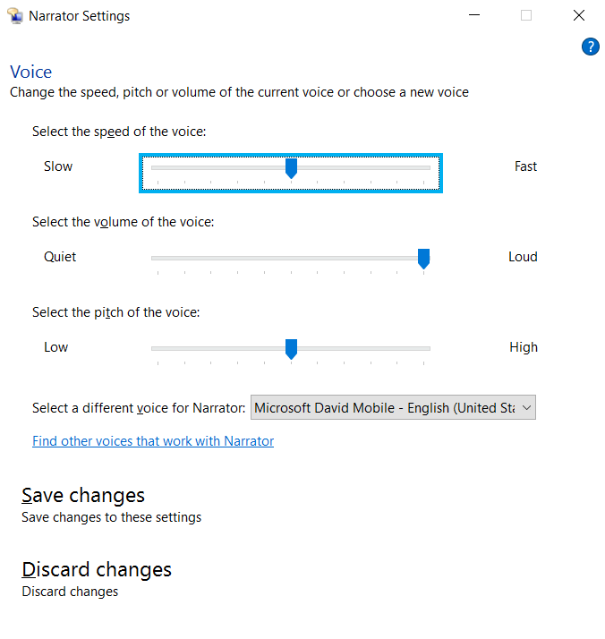

# Configuration Options

Similar to VoiceOver on a Mac, the Narrator screen reader comes built in to the Windows 10 Anniversary Update. If you have the Windows 10 Anniversary Update, no installation is required.

## How to start and turn off Narrator

The easiest way to start and stop Narrator is by using the Windows key + Control + Enter shortcut. The first time you press the keys together, a dialog box pops up prompting you to start the screen reader. When you are done using the screen reader, use the shortcut again to stop Narrator. You can also close Narrator by pressing Caps Lock + Escape.

Another way to open Narrator is to use the Start button in the left corner of the taskbar and navigate to the Ease of Access Center. In the Ease of Access Center, select Start Narrator. You can also access the Ease of Access Center on the sign-in screen to start Narrator.

## Adjusting Narrator options

When Narrator is turned on, you can access the screen reader's settings by selecting Narrator Settings icon on the taskbar. There is a list of setting options under Narrator Settings including general, navigation, and voice settings.

### General settings

Under the General settings, you can choose to lock the Narrator key (Caps Lock key) so you do not have to use it for specific commands. You can also choose whether to hear the characters or words you type, and choose to activate or deactivate the highlight cursor, or blue focus that appears around the Narrator virtual cursor. If you are new to Narrator, it may be best to leave the default general settings as is until you become more familiar with the screen reader.

### Navigation settings

In the Navigation settings, one thing to keep in mind as you are testing with Narrator is to ensure the "Read and interact with the screen using the mouse" option is not checked. When this option is checked, Narrator will follow and read everything under the mouse cursor. Majority of screen reader users navigate by keyboard only, so it is important that keyboard navigation is used in conjunction with Narrator.

### Voice settings

You can control the speed, volume, and pitch of the Narrator screen reader voice using the slider controls available in Voice settings, and you can also choose an entirely different voice for the screen reader. If you are looking to increase the speed of the Narrator voice, keep in mind that some voices read faster than others. The voices in Narrator that can read up to 800 words per minute are: Microsoft David Mobile, Microsoft Zira Mobile, and Microsoft Mark Mobile. However, if you are fairly new to using Narrator, you may want to read at a lower speed to ensure that Narrator is reading the content you are evaluating correctly.

Keyboard shortcuts can also be used to increase or decrease the speed or volume of the Narrator voice:

To increase or decrease the speed of the voice, use the keystroke Caps Lock + Plus (+) or Minus (-).
To increase or decrease the volume of the voice, use the keystroke Caps Lock + Control + Plus (+) or Minus (-).

### Verbosity settings

Another option you may want to consider is adjusting the verbosity levels in Narrator. Adjusting the verbosity levels in Narrator allows you to choose how much information you receive about text on a web page. Options range from only hearing text to hearing information about fonts and size of fonts. There are six verbosity level options (0 through 5) in Narrator and keystrokes are used to select the desired verbosity level.

To change the verbosity level in Narrator, use the keystroke Caps Lock + V. You can repeat the keystroke until you hear the verbosity level you want.

The verbosity levels in Narrator are:

- Verbosity level 0: only text
- Verbosity level 1: basic information like headings, spelling and grammatical errors
- Verbosity level 2: font styles like bold, italics, underline, and more; other formatting like bullet styles
- Verbosity level 3: additional information like headers and footers in a document
- Verbosity level 4: font names, font sizes, etc.
- Verbosity level 5: information about animations, layout; if paragraphs start with indentation, etc.
