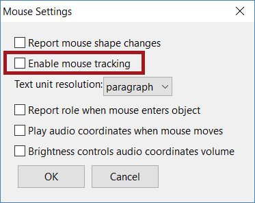
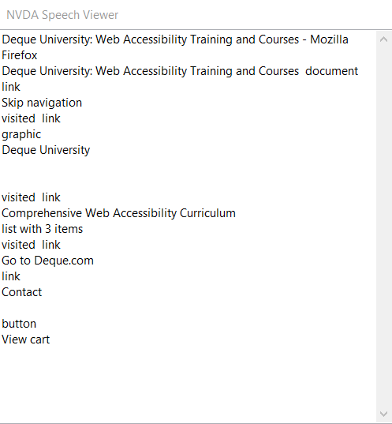

# NVDA Configuration Options

## NVDA installation

NVDA, which stands for Non-Visual Desktop Access, is a free downloadable screen reader available at http://www.nvaccess.org. When you download NVDA, there are three options you can select to use the screen reader. You can choose to install NVDA on your computer, create a portable USB copy to use on other machines, or use the temporary copy that is running upon download.

If you choose to install NVDA on your computer, there are some additional options to consider. One option is to choose whether NVDA launches automatically on the Windows login screen. This may be an option you will want to deactivate as the screen reader will come on every time you start your computer. Another option to consider is allowing NVDA to create a keyboard shortcut that allows you to start NVDA at any time. Activating this option is recommended as it will allow you to quickly start the screen reader whenever you may need it.

## How to start and turn off NVDA

If you have enabled the shortcut option, you can use the keyboard shortcut Control + Alt + N to start NVDA. You can also use the Start menu button in the left corner of the taskbar, search for NVDA and launch the application there. Additionally, if you have a desktop shortcut for NVDA, you can use the letter "N" to select the screen reader, or you can open the Run dialog and type "NVDA" in the field to start the screen reader.

When you start NVDA, a dialog box will appear and present options about using NVDA. The first option, "Use Caps Lock as an NVDA modifier key", allows you to choose whether you want to use the Caps Lock key in addition to or instead of the Insert key as the NVDA modifier key. To prevent confusion with using NVDA keystrokes, it may be best to leave this option unchecked.

The second option, "Automatically start NVDA after I log on to Windows", starts the screen reader automatically after logging into Windows. If you do not use the screen reader regularly, you may also want to leave this option unchecked.

The easiest way to turn off NVDA is by using the keystroke Insert + Q. If your Insert key is on your Numpad, you will want to make sure that your Num Lock is off. If you are a mouse user, you can also go into the notification area in the taskbar, right-click on the NVDA icon, and select "Exit" to quit the screen reader. Before quitting NVDA, make sure all dialog boxes within the screen reader application are closed. You cannot quit NVDA until the only dialog box open is the box asking if you are sure you want to quit the application.

## Adjusting NVDA options

### Disabling mouse settings

The first thing you may notice when you start NVDA is that the screen reader is following and reading everything under the mouse focus. This can be a bit jarring; plus, most screen reader users do not rely on a mouse as an input device. To disable mouse tracking:

- Locate the NVDA icon in the notification area of the taskbar (it may be in the notification overflow)
- Right-click on the NVDA icon and select "Preferences" from the menu
- Navigate to "Mouse Settings..."
- Uncheck the "Enable Mouse Tracking" checkbox, then select "OK"

or you can use the keyboard shortcut <b>Insert + M</b> to enable or disable mouse tracking at any time.

### Voice settings

Voice settings for NVDA can be found under the Preferences menu or can be opened using <b>Insert + Control + V</b>. If you are using the eSpeak NG synthesizer (the default voice synthesizer in NVDA), you will see under the "Voice" drop down menu all of the voices available for the synthesizer and variations of voices under the "Variant" drop down menu.

You will also find options to increase or decrease the rate, pitch, volume, and inflection (how much the pitch rises and falls while speaking). Additionally, you can choose how much punctuation NVDA acknowledges while reading under "Punctuation/symbol level".

The punctuation/symbol level can also be adjusted using the keystroke Insert + P. The "Automatic Language Switching" option allows NVDA to recognize language changes in a document if the language has been identified properly in the document.

### Document formatting settings

You can choose how much NVDA reports about a document under the Document Formatting settings. Located under Preferences, items you can select for NVDA to report include font name, font size, text alignment, colors, emphasis, spelling errors, links, headings, indentation, and more. These settings are similar to the Verbosity level settings for Narrator. You can also modify these settings at any time using the keystroke <b>Insert + Control + D</b>.

## Speech viewer

If you are evaluating a document or web page using NVDA, the Speech Viewer may be a helpful tool during the testing process. The Speech Viewer is a separate window that allows you to see what NVDA is saying as it is reading a document.

If you click or place focus inside the Speech Window, NVDA stops talking. You can then select and copy the spoken text and use in it your evaluations. The Speech View can be found under "Tools" in the NVDA menu (right-click on NVDA icon in the notification area to access the menu).

If you are quickly looking to use the Speech Viewer, you can create a keyboard shortcut for the Speech Viewer under "Input Gestures" in the NVDA menu.
