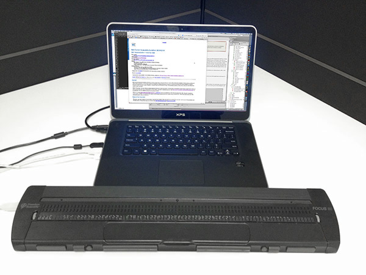

# What Are Screen Readers?

## Text to speech or braille

Screen readers are software programs that convert digital text into speech (via a software-based voice synthesizer) or braille output (to a refreshable braille device). Full-featured screen readers can read the interface and content in operating systems, software, web sites, and other digital assets.

Screen readers have revolutionized computer accessibility for people with disabilities, in particular those who are blind and deafblind, though other people use screen readers too. Screen readers allow blind people to use computers by themselves, without help from anybody else.

That sounds so basic, but it's actually a big deal, because it means that a blind person can get jobs that require computer use, send emails, read about current events on the internet, play games, and do pretty much anything that anybody else can do on a computer.

### Audio Output

Most users listen to the audio output of screen readers. The voice is synthesized, so it can sound robotic. The quality of the voice can vary drastically and depends largely on the underlying speech engine.

Most screen readers allow users to switch between different voices, which may sound like female or male voices. There are even voices that sound like children or elderly individuals.

### Braille Output

Most major screen readers can also output to refreshable braille devices. The braille can be in addition to the audio output, or it can be the only form of output, depending on the user's preferences.

A refreshable braille device has a long series of small holes in the hardware that allow small plastic pins to come up through the holes to form the braille characters that the person can feel using the fingertips. For people who are both deaf and blind, a braille device like this is pretty much the only way they can access digital content.

The refreshable braille device shown below is one of the larger models, allowing long lines of braille text. Smaller models are also available.

## Web sites must be designed to be compatible with screen readers

Screen readers cannot make inaccessible web sites accessible. The web sites have to be designed with accessibility in mind, or else they won't be compatible with screen readers. To be compatible with screen readers, web sites must adhere to the principles in the [Web Content Accessibility Guidelines 2.0](https://www.w3.org/TR/WCAG20/).

## Screen readers work with the accessibility API of the operating system and browser

The operating system has an accessibility API which conveys information about the names, roles, values, and structure of web content, plus events that should be announced to users. Browsers have additional accessibility architecture features which screen readers can detect and interpret, then pass on to screen reader users.

UI Automation is the modern accessibility API in Windows and in the Edge browser. More information about accessibility APIs can be found later in this course in [Accessibility APIs](../a11y-apis).
