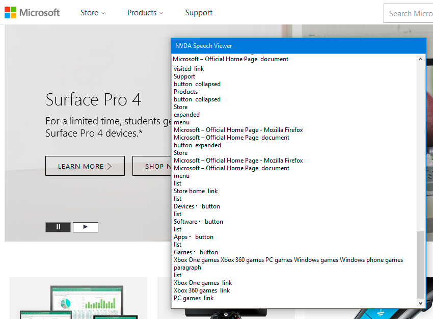

# Which Screen Readers Should You Test With?

## Combination 1: Firefox and NVDA, or Chrome and NVDA, or Edge and NVDA

The second most popular screen reader and browser combination is NVDA and Firefox. When accounting for usage of NVDA with other browsers, and JAWS with browsers other than Chrome, though, NVDA and JAWS are about equal in prevalence as users' primary screen reader at the time of this writing.

Usage of NVDA has been increasing over the years relative to usage of JAWS. The next most popular browser to use with NVDA is Chrome, and NVDA works well with both Chrome and Firefox.

Also, because the latest version of the Edge browser is based on the same Chromium browser that Chrome is based on, Edge effectively inherits compatibility with the screen readers designed to work with Chrome, namely NVDA and JAWS.

NVDA provides a useful tool called the Speech Viewer, described later on this page, that allows for those testing the page to easily view the screen reader output and identify errors. This makes the combination of NVDA with Firefox or Chrome quite useful.

## Combination 2: Chrome and JAWS, or Edge and JAWS

The most popular screen reader and browser combination as of this writing is JAWS and Chrome. It used to be that JAWS worked best with Internet Explorer, which was the most popular combination for many years.

JAWS has since been updated to work with Chrome's accessibility API in particular, and this is now the most compatible browser to use with JAWS, along with the Edge browser, which now shares Chrome's screen reader compatibility, as described under combinations of NVDA and its compatible browsers.

Even though the combination of JAWS and Internet Explorer is no longer the most commonly used, and does not take full advantage of UI Automation, it is valuable to ensure that web content works as expected in IE and JAWS because a significant percentage of users still use this combination.

### Note:

Be aware that JAWS will sometimes try to improve the user experience by guessing at certain things, such as form labels. If a form input is missing a programmatic label but has adjacent text that could be interpreted as a label, JAWS will read that text as if it is an actual label. Usually JAWS guesses quite well.

Occasionally JAWS guesses incorrectly, but the real danger to testers is that they might assume that the form field has a label, when it actually doesn't. If it sounds right, that may or may not mean that the code is right, and the tester is less likely to double check the code.

## Mobile

It is important to test with both VoiceOver with Safari (iOS), and TalkBack with Chrome (Android) because users widely own both products, and the two programs vary in scope and ability. VoiceOver tends to have more capabilities than TalkBack, so it is important to make websites accessible for both mediums.

## Other browsers and screen readers

For most web sites, it is reasonably safe to say that testing and fixing accessibility issues in Firefox/NVDA and Chrome/JAWS is sufficient to find the vast majority of potential accessibility problems. In fact, from a practical standpoint, one screen reader and browser combination is almost always enough when testing standard, non-interactive web content like paragraphs, images, tables, headings, landmarks, form structure, links, and so on.

Interactive content — like form validation and custom JavaScript/ARIA widgets — can be trickier, because that is where the differences between screen readers and browsers (including bugs or lack of accessibility support for certain techniques) is most likely to occur. It is worthwhile to test interactive content in multiple screen reader and browser combinations.

### Screen reader prevalence

When deciding which other screen readers to test with, it can be helpful to know which screen readers are most popular. Scientific data on screen reader usage statistics are not readily available, but WebAIM publishes a screen reader survey periodically which, while non-scientific in its methods, has become a de facto benchmark for screen reader information.

The most recent (as of this writing) is [WebAIM's screen reader survey #8](http://webaim.org/projects/screenreadersurvey8/). Results of the previous surveys are also published on the WebAIM site.

The following shows screen readers and browsers, listed according to their estimated prevalence among blind users:

#### Desktop screen readers: (Operating system is Windows unless otherwise noted.)

- JAWS with Chrome
- NVDA with Firefox
- NVDA with Chrome
- JAWS with IE
- VoiceOver with Safari (macOS)
- Narrator with Edge

#### Mobile screen readers:

- VoiceOver with Safari (iOS)
- TalkBack with Chrome (Android)

##### Note:

Some screen readers support multiple browsers to some degree, but all screen readers work best when paired with their favored browser (in accordance with the lists above). Using JAWS with Edge will work for some things, for example, but it will not be as robust an experience as using JAWS with Chrome and will not be as accurate of an accessibility test.

## Capturing screen reader output with NVDA

NVDA's Speech Viewer provides an easy way to capture output which can be copied and pasted into bug tickets or other reports. To turn on Speech Viewer, activate the NVDA icon in the system tray, then select Tools > Speech Viewer.

NVDA's Speech Viewer is illustrated in the screenshot below, showing the output as the user navigates through the Microsoft home page.

