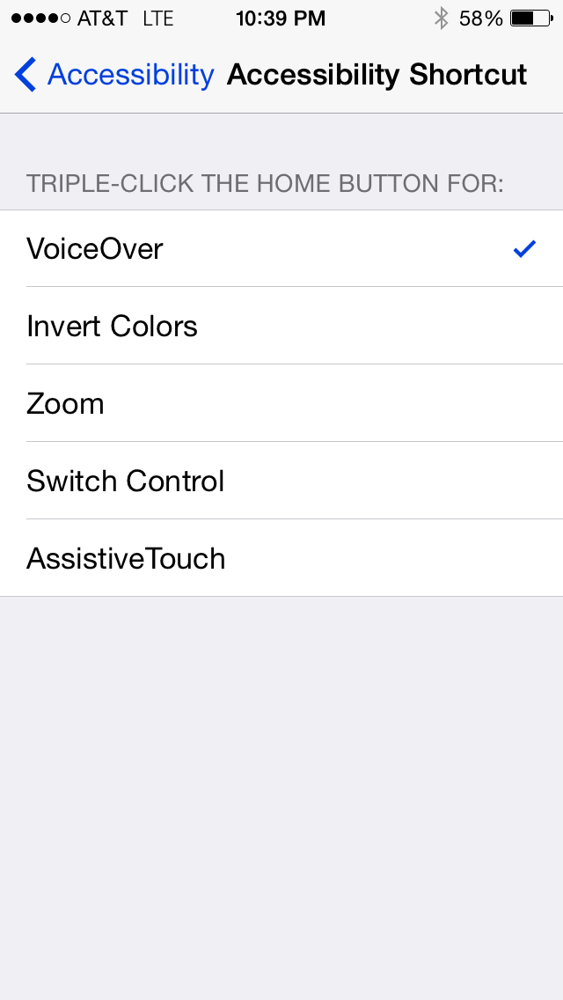
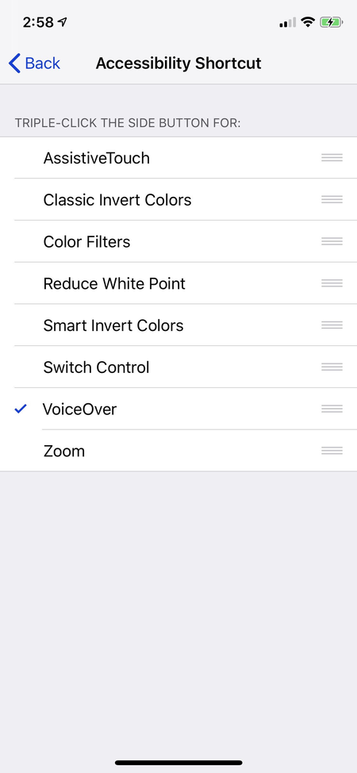

# VoiceOver (iOS) Configuration Guide

## How to start VoiceOver on iOS

The quickest way to turn on VoiceOver on iOS is to create the accessibility shortcut on your device. If you plan on doing a lot of accessibility testing, you will probably want to enable the accessibility shortcut so you can turn the VoiceOver screen reader on and off quickly with three quick clicks to the Home button (on iOS devices made prior to the iPhone X) or the button on the right side (for iPhone X and later iOS devices, which have no Home button).

You can create the accessibility shortcut using these steps:

Settings > General > Accessibility > Accessibility Shortcut (at the bottom)

Select the accessibility option that will be activated by the triple-click shortcut; in this case, select VoiceOver.

Setting the accessibility shortcut on devices prior to iPhone X

If you do not create the shortcut, then you can turn VoiceOver on by navigating to Settings > General > Accessibility > VoiceOver.

## VoiceOver replacing standard gestures

The first thing to know about VoiceOver, and about all screen readers on touch devices, is that it completely replaces the standard gestures that you're used to. You can no longer just touch buttons to activate them. You can't swipe left to go to the previous page. You can't swipe down to scroll the viewport down. You lose those features. In place of the gestures that you lost are a whole host of other gestures designed to work without having to look at your screen. They're designed for blind people.

## Adjusting VoiceOver iOS options

### The rotor

Customizing VoiceOver can be pretty easy when you have the options available to you in the rotor, but you first need to select the options that you want to access through the rotor. To choose rotor options, go to Settings > General > Accessibility > VoiceOver > Rotor. To operate the rotor, rotate two fingers on the screen. You can rotate either left or right to operate the rotor.

### Voice settings

There are a number of options available to you to change the Voice settings in VoiceOver on iOS. The settings for rate, pitch, and voice changes are available under Settings > General > Accessibility > VoiceOver. You can also choose to add speech rate and volume to the rotor and adjust the settings by swiping up or down.

You can also change how much punctuation VoiceOver speaks. To edit the punctuation settings, you have to set the rotor to Punctuation. After you set the rotor to Punctuation, you can swipe up or down to choose the punctuation you want to hear.
