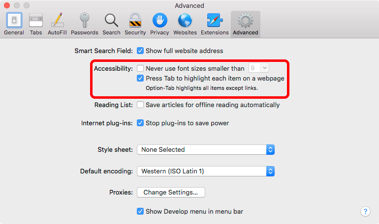

# Enabling Keyboard Access on a Mac

Keyboard accessibility is NOT enabled by default on a Mac. Your accessibility and screen reader test results will be inaccurate if you do not enable keyboard accessibility in the following two places:

- System Preferences
- Safari Preferences

## Enable System-Wide Keyboard Accessibility

The default keyboard access on a Mac is to allow users to tab only to form controls (text inputs, buttons, etc.). To tab to links and other elements, you need to enable the "All controls" setting in:

System Preferences > Keyboard > Shortcuts > Full Keyboard Access > All controls

## Enable Safari Keyboard Accessibility

Keyboard accessibility must also be enabled separately in Safari too.

Safari Preferences > Advanced > Accessibility > Press Tab to highlight each item on a webpage.

