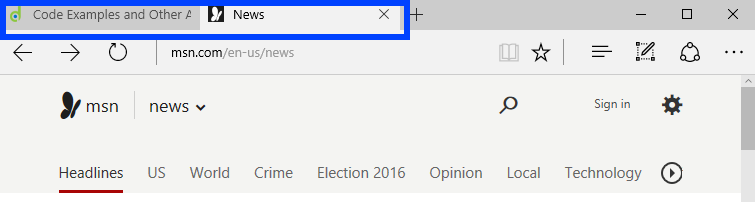

# Page Title

## The purpose of the page `<title>`

The page `<title>`, which is generally displayed in the tab of a browser, is a quick way to learn about the content on the web page. When screen reader users have multiple tabs open in a browser, they can use the page `<title>` to quickly identify web pages. If the web page does not have a descriptive `<title>`, it may force a screen reader user to navigate through the content to find out what the page is about.

## How screen readers treat the page `<title>`

Screen readers will typically announce the page `<title>` as soon as the web page loads. It is the first thing users hear. Some screen readers will also announce things like the number of headings, landmarks, links, and form elements.

## Matching the page `<title>` and first heading

The page `<title>` and the top heading on the web page (heading level one) can both perform the same function, titling the entire web page. Screen reader users usually expect to hear the same information, or similar information, in the page `<title>` and top heading.

If the page `<title>` and top heading are the same, it allows for the screen reader user to get a general idea of the information on the page whether they are cycling through page titles or reading the content on the page.
